# Detective Town

**A murder mystery engine where cases emerge from simulated NPC lives.**

Detective Town is a local-first mystery engine for fair-play detective games. It does not ask an LLM to invent the culprit or write a mystery from scratch. The engine first simulates a town: NPC schedules, relationships, secrets, memories, conflicts, movements, evidence, and testimony. A case is then extracted from the world event log and validated by local TypeScript rules.

DeepSeek is used only for NPC surface dialogue and optional solution prose. It does not decide the culprit, method, evidence, or timeline.

> Screenshot/GIF target: create the Showcase town, search one scene, interrogate one NPC, then open the Developer / Agent API panel. The demo is deterministic, so screenshots do not depend on live model output.

## Why It Is Different

- **Simulated NPC lives**: NPCs have schedules, secrets, relationships, and memories.
- **Event-sourced evidence**: decisive clues must come from `WorldEvent` records.
- **Memory-scoped testimony**: NPCs can only answer from visible memories and discovered evidence.
- **Symbolic culprit validation**: local rules verify motive, means, opportunity, exclusions, and reasoning coverage.
- **Playable investigation**: search scenes, question NPCs, challenge testimony with evidence, submit a theory, and reveal the solution.

## Default Showcase

The default demo is intentionally compact and explainable:

- 8 NPCs.
- 1 town map with 9 locations.
- 24-hour timeline.
- 1 murder case.
- Evidence graph.
- Interrogation system.
- Unique culprit validation.

Advanced mode keeps the larger 30 NPC multi-day simulation for development and stress testing.

## Architecture

```mermaid
flowchart LR
  A["Seed"] --> B["NPC schedules"]
  B --> C["World events"]
  C --> D["NPC memories"]
  D --> E["Social pressure"]
  E --> F["Murder event"]
  F --> G["Evidence placement"]
  G --> H["Case extraction"]
  H --> I["Rule validation"]
  I --> J["Playable investigation"]
  J --> K["Theory judgement"]
```



## Quick Start

```powershell
cd E:\xuexi\detective-novel-lab
npm install
npm run dev -- -p 3000
```

Open:

```text
http://localhost:3000
```

Click **Create Detective Town**. No API key is required; without DeepSeek credentials, NPC interrogation uses rule-bound local replies.

## Configuration

Copy `.env.example` to `.env`:

```env
AI_PROVIDER=deepseek
DEEPSEEK_API_KEY=your_deepseek_key
DEEPSEEK_BASE_URL=https://api.deepseek.com
DEEPSEEK_MODEL=deepseek-v4-flash
DATABASE_URL=file:./data/mystery-town.db
```

API keys are read only on the server. Do not expose them in client code.

## API

Stable Agent Control API:

- `GET /api/v1/query/runtime/status`
- `GET /api/v1/query/world/state?worldId=...`
- `GET /api/v1/query/world/events?worldId=...`
- `GET /api/v1/query/world/memories?worldId=...&npcId=...`
- `GET /api/v1/query/case?caseId=...`
- `POST /api/v1/command/town/create`
- `POST /api/v1/command/player/join`
- `POST /api/v1/command/investigation/discover`
- `POST /api/v1/command/investigation/interrogate`
- `POST /api/v1/command/investigation/submit-theory`

`/api/v1/*` responses use one shape:

```json
{ "ok": true, "data": {} }
```

```json
{ "ok": false, "error": { "code": "WORLD_NOT_FOUND", "message": "World not found" } }
```

Example:

```powershell
curl -X POST http://localhost:3000/api/v1/command/town/create `
  -H "Content-Type: application/json" `
  -d '{ "seed": "showcase-seed", "mode": "showcase", "npcCount": 8, "timelineHours": 24, "caseArchetype": "auto" }'
```

Legacy world and investigation APIs remain available:

- `POST /api/worlds/create`
- `POST /api/worlds/{worldId}/tick`
- `POST /api/worlds/{worldId}/simulate-days`
- `GET /api/worlds/{worldId}/state`
- `GET /api/worlds/{worldId}/events`
- `GET /api/worlds/{worldId}/memories`
- `GET /api/worlds/{worldId}/constraints`
- `POST /api/cases/from-world`
- `GET /api/cases/{caseId}`
- `GET /api/cases/{caseId}/testimonies`
- `GET /api/cases/{caseId}/quality`
- `GET /api/cases/{caseId}/reasoning-trace`
- `POST /api/players/join`
- `POST /api/investigation/discover`
- `POST /api/investigation/interrogate`
- `POST /api/investigation/submit-theory`
- `POST /api/investigation/reveal`
- `GET /api/ai/live-eval/latest`

Default creation payload:

```json
{
  "seed": "showcase-seed",
  "mode": "showcase",
  "npcCount": 8,
  "timelineHours": 24,
  "caseArchetype": "auto"
}
```

`mode` may be `showcase` or `advanced`. `caseArchetype` may be `auto`, `blade`, `poison`, `blunt`, or `fall`.

Legacy structured case and novel generation remain available through:

- `POST /api/generate`

## Engine Exports

Core exports are available from `packages/engine/src` and `lib/engine`:

- Deduction engine: `validateCase`, `validateCaseSchema`, `judgeTheory`, `evaluateEvidenceChallenge`, `getTimelineContradictions`, `deriveSuspectMatrix`, `getReasoningCoverage`.
- World engine: `createInitialWorld`, `simulateDailyLife`, `simulateWorldTick`, `extractCaseFromWorld`, `validateWorldCase`, `buildNpcKnowledgeContext`, `makeRuleBoundInterrogation`, `updateTestimonyWithContradiction`, `buildTravelConstraint`, `analyzeReachability`, `buildCaseQualityReport`, `buildReasoningTrace`, `submitWorldTheory`.
- Evaluation: `runEval`, `renderEvalMarkdown`.

## Tests

```powershell
npm run build
npm run test:rules
npm run test:world
npm run test:ai
npm run test
npm run eval
node scripts/run-agent-api-smoke.mjs
```

`npm run test:world` checks deterministic Showcase generation, 8 NPC default mode, 24h timeline, event-backed evidence, memory-scoped testimony, unique culprit validation, non-culprit exclusions, reasoning traces, and advanced 30 NPC regression.

Optional live DeepSeek eval:

```powershell
npm run test:deepseek
```

The live eval is intentionally not part of the default test command. It uses local `.env.local` / `.env` credentials and writes reports under `outputs/`.

## Docs

- [Agent Control API](docs/agent-control-api.md)
- [World Model](docs/world-model.md)
- [AI Safety](docs/ai-safety.md)
- [Showcase Walkthrough](docs/showcase-walkthrough.md)

## Current Limits

- Local async multiplayer only; no account system or WebSocket realtime layer.
- Showcase mode is designed for explainability, not maximum simulation complexity.
- Advanced mode remains deterministic and archetype-based.
- DeepSeek can improve dialogue style, but server-side memory gates control what the model can know.

## Roadmap

- Browser screenshot regression for the Showcase flow.
- Richer town maps and evidence graph interactions.
- More case archetypes.
- Optional solver integration for stricter travel and opportunity constraints.
- Community case gallery.
