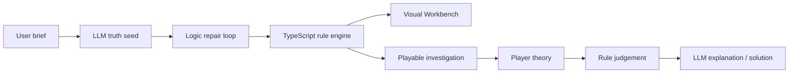

# Deduction Engine

**LLM + Symbolic Rules + Visual Case Workbench for fair-play detective games.**

Deduction Engine is an open-source prototype for generating and validating fair-play mystery cases. It does not ask an LLM to simply write a story. Instead, the LLM proposes a structured truth model, the local TypeScript rule engine validates it, and the Web Workbench visualizes suspects, clues, timelines, contradictions, and reasoning coverage.

## Why It Is Different

- **JSON-first mystery design**: every case has a structured culprit, motive, method, opportunity, timeline, evidence set, and exclusion chain.
- **Symbolic rule engine**: local rules check unique culprit, fair clues, suspect matrix, timeline contradictions, and reasoning coverage.
- **Visual Workbench**: inspect truth structure, suspect matrix, evidence graph, timeline contradictions, rule report, schema status, eval metrics, and raw JSON.
- **SDK-ready engine**: reusable TypeScript exports live under `packages/engine` while the Next.js app remains the official demo.
- **Playable demo**: search scenes, discover evidence, challenge characters, submit a theory, and reveal the solution.
- **Showcase mode**: no API key required. Load the built-in demo case and inspect the full engine flow.

## Architecture



## Quick Start

```powershell
cd E:\xuexi\detective-novel-lab
npm install
npm run dev -- -p 3000
```

Open:

```text
http://localhost:3000
```

Click **Demo Case** to use the built-in showcase without any API key.

## Model Configuration

Copy `.env.example` to `.env`:

```env
AI_PROVIDER=deepseek
DEEPSEEK_API_KEY=your_deepseek_key
DEEPSEEK_BASE_URL=https://api.deepseek.com
DEEPSEEK_MODEL=deepseek-v4-flash
```

Restart the dev server after editing `.env`.

## API

The public API remains:

```text
POST /api/generate
```

Game stages:

- `gameTruthSeed`: generate structured case JSON and run repair attempts.
- `gameLogicRepair`: repair invalid structured JSON.
- `gameCaseFile`: write the player-visible case file.
- `gameDialogue`: generate ordinary character dialogue.
- `gameEvidenceChallenge`: generate evidence-based interrogation response.
- `gameJudgement`: explain the local rule judgement.
- `gameSolutionReveal`: reveal the full solution after a correct theory.

Novel generation stages remain:

- `quickSynopsis`
- `quickOutline`
- `quickChapter`

## Engine Exports

Core exports are available from `packages/engine/src` and through the compatibility layer `lib/engine`:

- `createFallbackCase`
- `createShowcaseCase`
- `validateCase`
- `validateCaseSchema`
- `judgeTheory`
- `evaluateEvidenceChallenge`
- `getTimelineContradictions`
- `deriveSuspectMatrix`
- `getReasoningCoverage`
- Types: `DeductionCase`, `LogicPuzzle`, `Evidence`, `Character`, `PlayerTheory`

Example:

```ts
import { createShowcaseCase, judgeTheory, validateCase } from "./packages/engine/src";

const deductionCase = createShowcaseCase();
const report = validateCase(deductionCase);
const judgement = judgeTheory(deductionCase, {
  culpritId: deductionCase.truth.culpritId,
  motive: deductionCase.truth.motive,
  method: deductionCase.truth.method,
  evidenceIds: deductionCase.logicPuzzle.criticalEvidenceIds,
});
```

## Tests

```powershell
npm run build
npm run test:rules
npm run eval
```

`npm run eval` writes:

- `outputs/eval-report.json`
- `outputs/eval-report.md`

DeepSeek API integration test:

```powershell
npm run dev -- -p 3000
node scripts/run-deduction-game-test.mjs
```

Generated test artifacts are saved under `outputs/`, which is ignored by Git.

## Deployment

This project is ready for Vercel-style deployment. Public deployments should rely on **Demo Case** / Showcase mode by default and keep model API keys in server-side environment variables only.

Required environment variables for live generation:

- `AI_PROVIDER`
- `DEEPSEEK_API_KEY`
- `DEEPSEEK_BASE_URL`
- `DEEPSEEK_MODEL`

## Docs

- [Architecture](docs/architecture.md)
- [Case Schema](docs/case-schema.md)
- [Rule Engine](docs/rule-engine.md)
- [Prompt Pipeline](docs/prompt-pipeline.md)
- [SDK API](docs/sdk-api.md)
- [Evaluation](docs/evaluation.md)
- [JSON Schema](docs/json-schema.md)
- [Contributing](CONTRIBUTING.md)

## Roadmap

- More built-in case fixtures.
- Published npm package.
- More formal solver layer for timeline and opportunity constraints.
- Browser screenshot tests for the Workbench.
- Community case gallery.
