# Detective Town

**A murder mystery engine where cases emerge from simulated NPC lives.**

Detective Town is a local-first mystery engine for fair-play detective games. It does not ask an LLM to invent the culprit or write a mystery from scratch. The engine first simulates a town: NPC schedules, relationships, secrets, memories, conflicts, movements, evidence, and testimony. A case is then extracted from the world event log and validated by local TypeScript rules.

DeepSeek is used only for NPC surface dialogue and optional solution prose. It does not decide the culprit, method, evidence, or timeline.


**Online demo:** deployment URL placeholder. The hosted build uses the browser-only Static Demo Runtime, so it needs no API key or writable database.

## 30-Second Experience

1. Open the app: the Premium Showcase, 8 NPCs, map, timeline, case file, and guided task queue are already loaded.
2. Follow the first-case guide: observe the crime window, click a searchable location, question an NPC, then challenge testimony with evidence.
3. Each discovered clue explains how it may be used: who to question, what type of testimony it may contradict, and whether it belongs in the evidence chain.
4. Submit a deliberately wrong theory first. The UI shows only structured gap cards, not the answer.
5. Submit the complete theory. The final deduction node, source-locked solution, and full causal trace unlock only after the local rule engine accepts it.

See [docs/first-case-guide.md](docs/first-case-guide.md) for the guided first case flow.

## Product Design Goal

The product direction is **map-first investigation + explainable deduction + first-case completion**:

- The map is the primary screen, not a debug panel.
- The task queue tells a first-time visitor what to do next without hiding the underlying engine.
- The Inspector follows context: selected location, NPC, evidence, event, and rule report.
- Locked deduction nodes prevent spoiler leakage before the player earns the clue.
- Static Demo mode must be playable in a public deployment with no API key and no writable SQLite directory.

## Why Not Just Ask An LLM?

Direct LLM mystery generation is easy to demo but hard to trust: the model can invent clues after the fact, leak the culprit through dialogue, create multiple valid suspects, or rely on facts the player could never discover.

Detective Town uses the LLM only as a surface language layer. The durable case logic is local and inspectable:

- the town simulation produces `WorldEvent` records before the case file is written;
- evidence must point back to those events;
- NPC answers are constrained by their `MemoryRecord` scope and discovered evidence;
- local rules validate unique culprit, motive / means / opportunity, alibis, exclusions, clue availability, and reasoning coverage;
- the UI exposes the audit trail through the map, event log, Causal Trace, Deduction Graph, suspect board, and rule report.

## Why It Is Different

- **Simulated NPC lives**: NPCs have schedules, secrets, relationships, and memories.
- **Event-sourced evidence**: decisive clues must come from `WorldEvent` records.
- **Memory-scoped testimony**: NPCs can only answer from visible memories and discovered evidence.
- **Explainable emergence**: goals, intents, and causal links show how the case came out of simulated life events.
- **Symbolic culprit validation**: local rules verify motive, means, opportunity, exclusions, and reasoning coverage.
- **Playable investigation**: search scenes, question NPCs, challenge testimony with evidence, submit a theory, and reveal the solution.
- **Case authoring**: authors can edit a playable case draft, run real-time hard-logic validation, and export runnable JSON or Markdown.

## Case Library

Static Demo and Authoring mode include three deterministic 8 NPC / 24h cases:

| Template id | Case | Focus |
| --- | --- | --- |
| `archive-blunt` | Archive blunt-force misdirection | strong red herrings, staged scene, exclusion chain |
| `clocktower-locked-room` | Clocktower locked-room timing case | timeline contradiction, mechanical misdirection |
| `clinic-poison` | Clinic poison testimony case | testimony reversal, medicine-cabinet records |

Every template is validated by `validateHardCaseLogic`, has a complete `WorldCausalTrace`, keeps decisive clues backed by `WorldEvent` records, and gives every non-culprit a discoverable exclusion.

## Case Authoring Workbench

The app now includes an Authoring mode next to the default Play mode. It loads an editable copy of the Premium Showcase and keeps draft changes in browser `localStorage` under `detective-town-authoring-v1`.

Authoring supports:

- Editing case title, public case file, characters, scenes, evidence, timeline events, red herrings, clue order, and suspect matrix rows.
- Live validation with schema issues, rule errors, hard-case logic, suspect board, deduction graph, quality score, logic strength, misdirection quality, and reasoning coverage.
- `Export JSON` for a runnable `AuthoringDraft`.
- `Import JSON` for an `AuthoringDraft` or standalone `DeductionCase`.
- `Export Markdown` for case documentation.
- `Run Draft` when hard logic passes, using the browser-only Static Demo Runtime.

See [docs/authoring-workbench.md](docs/authoring-workbench.md).

## Default Showcase

The default demo is intentionally compact and explainable:

- 8 NPCs.
- 1 town map with 9 locations.
- 24-hour timeline.
- 1 murder case.
- Evidence graph.
- Interrogation system.
- Unique culprit validation.

Advanced mode keeps the larger 30 NPC multi-day simulation for development and stress testing.

## Architecture

```mermaid
flowchart LR
  A["Seed"] --> B["NPC schedules"]
  B --> C["NPC goals and intents"]
  C --> D["World events"]
  D --> E["NPC memories"]
  E --> F["Social pressure"]
  F --> G["Causal trace"]
  G --> H["Murder event"]
  H --> I["Evidence placement"]
  I --> J["Case extraction"]
  J --> K["Rule validation"]
  K --> L["Playable investigation"]
  L --> M["Theory judgement"]
```



## Quick Start

```powershell
cd E:\xuexi\detective-novel-lab
npm install
npm run dev -- -p 3000
```

Open:

```text
http://localhost:3000
```

The Premium Showcase loads automatically at 08:00. Add `?runtime=static` for the browser-only runtime or `?runtime=server` for SQLite + DeepSeek.

## Configuration

Copy `.env.example` to `.env`:

```env
AI_PROVIDER=deepseek
DEEPSEEK_API_KEY=your_deepseek_key
DEEPSEEK_BASE_URL=https://api.deepseek.com
DEEPSEEK_MODEL=deepseek-v4-flash
DATABASE_URL=file:./data/mystery-town.db
NEXT_PUBLIC_DEMO_MODE=server
```

API keys are read only on the server. Do not expose them in client code.

## API

Stable Agent Control API:

- `GET /api/v1/query/runtime/status`
- `GET /api/v1/query/world/state?worldId=...`
- `GET /api/v1/query/world/events?worldId=...`
- `GET /api/v1/query/world/memories?worldId=...&npcId=...`
- `GET /api/v1/query/world/map?worldId=...&caseId=...&sessionId=...&day=1&time=21:30`
- `GET /api/v1/query/case?caseId=...`
- `GET /api/v1/query/case/deduction-graph?caseId=...`
- `POST /api/v1/command/town/create`
- `POST /api/v1/command/player/join`
- `POST /api/v1/command/investigation/discover`
- `POST /api/v1/command/investigation/interrogate`
- `POST /api/v1/command/investigation/submit-theory`

`/api/v1/*` responses use one shape:

```json
{ "ok": true, "data": {} }
```

```json
{ "ok": false, "error": { "code": "WORLD_NOT_FOUND", "message": "World not found" } }
```

Example:

```powershell
curl -X POST http://localhost:3000/api/v1/command/town/create `
  -H "Content-Type: application/json" `
  -d '{ "seed": "showcase-seed", "mode": "showcase", "caseMode": "premium", "caseTemplateId": "archive-blunt", "npcCount": 8, "timelineHours": 24, "caseArchetype": "auto" }'
```

Legacy world and investigation APIs remain available:

- `POST /api/worlds/create`
- `POST /api/worlds/{worldId}/tick`
- `POST /api/worlds/{worldId}/simulate-days`
- `GET /api/worlds/{worldId}/state`
- `GET /api/worlds/{worldId}/events`
- `GET /api/worlds/{worldId}/memories`
- `GET /api/worlds/{worldId}/constraints`
- `POST /api/cases/from-world`
- `GET /api/cases/{caseId}`
- `GET /api/cases/{caseId}/testimonies`
- `GET /api/cases/{caseId}/quality`
- `GET /api/cases/{caseId}/reasoning-trace`
- `POST /api/players/join`
- `POST /api/investigation/discover`
- `POST /api/investigation/interrogate`
- `POST /api/investigation/submit-theory`
- `POST /api/investigation/reveal`
- `GET /api/ai/live-eval/latest`

Default creation payload:

```json
{
  "seed": "showcase-seed",
  "mode": "showcase",
  "caseMode": "premium",
  "caseTemplateId": "archive-blunt",
  "npcCount": 8,
  "timelineHours": 24,
  "caseArchetype": "auto"
}
```

`mode` may be `showcase` or `advanced`. `caseMode` may be `premium` or `generated`. `caseTemplateId` may be `archive-blunt`, `clocktower-locked-room`, or `clinic-poison`. `caseArchetype` may be `auto`, `blade`, `poison`, `blunt`, or `fall`.

Legacy structured case and novel generation remain available through:

- `POST /api/generate`

## Engine Exports

Core exports are available from `packages/engine/src` and `lib/engine`:

- Deduction engine: `validateCase`, `validateCaseSchema`, `judgeTheory`, `evaluateEvidenceChallenge`, `getTimelineContradictions`, `deriveSuspectMatrix`, `getReasoningCoverage`.
- World engine: `createInitialWorld`, `simulateDailyLife`, `simulateWorldTick`, `extractCaseFromWorld`, `validateWorldCase`, `buildNpcKnowledgeContext`, `makeRuleBoundInterrogation`, `updateTestimonyWithContradiction`, `buildTravelConstraint`, `analyzeReachability`, `buildCaseQualityReport`, `buildReasoningTrace`, `submitWorldTheory`.
- Evaluation: `runEval`, `renderEvalMarkdown`.
- Static runtime: `createStaticDemoRuntime`, `discoverDemoEvidence`, `interrogateDemoNpc`, `submitDemoTheory`, `revealDemoSolution`.
- Visual logic: `buildWorldMapSnapshot`, `buildDeductionGraph`, `deriveSuspectBoard`, `buildCaseLogicReport`, `validateHardCaseLogic`.
- Case library and emergence: `createCaseLibrary`, `createCaseTemplate`, `listCaseTemplates`, `buildWorldCausalTrace`, `validateCausalTrace`, `deriveNpcIntentTimeline`.
- Authoring: `createAuthoringDraftFromCase`, `createPremiumAuthoringDraft`, `validateAuthoringDraft`, `applyAuthoringPatch`, `exportAuthoringJson`, `exportAuthoringMarkdown`.

## Tests

```powershell
npm run build
npm run test:rules
npm run test:world
npm run test:ai
npm run test:encoding
npm run test
npm run eval
npm run test:e2e
node scripts/run-agent-api-smoke.mjs
```

`npm run test:world` checks deterministic Showcase generation, all three premium templates, 8 NPC default mode, 24h timeline, event-backed evidence, memory-scoped testimony, unique culprit validation, non-culprit exclusions, causal traces, reasoning traces, and advanced 30 NPC regression. `npm run test:encoding` fails on known mojibake markers in app, engine, and E2E source files.

Optional live DeepSeek eval:

```powershell
npm run test:deepseek
```

The live eval is intentionally not part of the default test command. It uses local `.env.local` / `.env` credentials and writes reports under `outputs/`.

## Docs

- [Agent Control API](docs/agent-control-api.md)
- [World Model](docs/world-model.md)
- [AI Safety](docs/ai-safety.md)
- [Showcase Walkthrough](docs/showcase-walkthrough.md)
- [Runtime Modes](docs/runtime-modes.md)
- [Deployment](docs/deployment.md)

## Current Limits

- Local async multiplayer only; no account system or WebSocket realtime layer.
- Showcase mode is designed for explainability, not maximum simulation complexity.
- Advanced mode remains deterministic and archetype-based.
- DeepSeek can improve dialogue style, but server-side memory gates control what the model can know.

## Roadmap

- Public hosted Static Demo.
- Additional authored Premium cases beyond the built-in three.
- Optional solver integration for stricter travel and opportunity constraints.
- Community case gallery.
