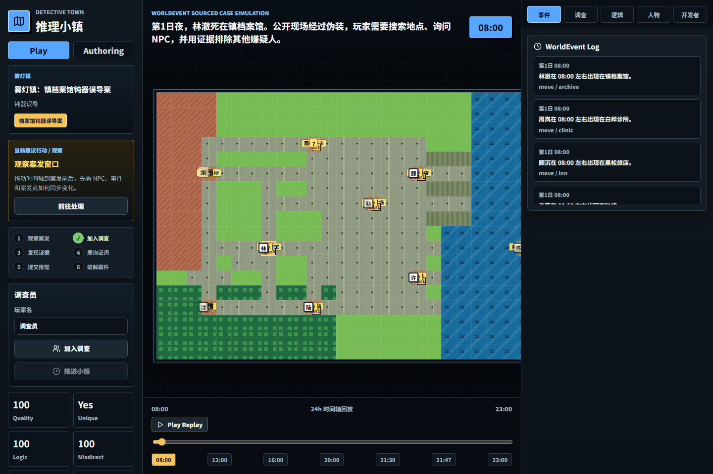

# Detective Town

**A murder mystery engine where cases emerge from simulated NPC lives.**

Detective Town is a local-first mystery engine for fair-play detective games. It does not ask an LLM to invent the culprit or write a mystery from scratch. The engine first simulates a town: NPC schedules, relationships, secrets, memories, conflicts, movements, evidence, and testimony. A case is then extracted from the world event log and validated by local TypeScript rules.

The project now also includes two advanced labs:

- **Persistent Agent Town**: a SQLite-backed runtime where NPCs keep goals, plans, memories, pressure, resources, and action scores across ticks until playable case candidates emerge.
- **Living World Lab + Audit Studio**: a novel/world observer workbench for extracting a world graph from chapters, auditing extraction quality, applying local correction overlays, replaying source-backed character actions, and exposing the same observe -> decide -> intervene -> observe loop through `/api/v1/*`.
- **Scenario Runner + Time Machine**: reproducible town experiments with baseline/counterfactual branch reports, tick snapshots, state diffs, rollback, and benchmark visibility.

DeepSeek is used only for NPC surface dialogue and optional solution prose. It does not decide the culprit, method, evidence, or timeline.



**Online demo:** public deployment URL is not connected yet. Deploy the repository to Vercel and open `https://<project>.vercel.app/?runtime=static` for the browser-only Static Demo Runtime. It needs no API key, no SQLite write access, and no `/api/*` calls. See [docs/static-demo-vercel.md](docs/static-demo-vercel.md).

## Release Status

- Latest planned release: `v0.1.0`.
- CI covers engine tests, build, emergence benchmark, Scenario API smoke, SDK smoke, and browser E2E.
- Docker Smoke covers Server Runtime startup and static page loading.
- Static Demo is public-demo ready; Persistent Agent Town, Scenario Runner, Time Machine, and Agent API require Server Runtime.

## Try In 3 Modes

```powershell
npm install
npm run dev -- -p 3000
```

- **Static Demo**: open `http://127.0.0.1:3000/?runtime=static` for the public, no-server Premium Showcase.
- **Server Runtime**: open `http://127.0.0.1:3000/?runtime=server` for SQLite-backed worlds, Persistent Agent Town, Scenario Runner, Time Machine, and optional DeepSeek dialogue.
- **Agent API**: run `node examples/agent-client-node/index.mjs` or `node examples/scenario-runner/index.mjs` against a running server, or reuse the SDK starter in `examples/sdk`.

## 30-Second Experience

1. Open the app: the Premium Showcase, 8 NPCs, map, timeline, case file, and guided task queue are already loaded.
2. Follow the first-case guide: observe the crime window, click a searchable location, question an NPC, then challenge testimony with evidence.
3. Use the **Evidence Notebook**: each discovered clue shows its source location, source event, suggested NPC challenge, and whether it belongs in the evidence chain.
4. Submit a deliberately wrong theory first. The UI shows only structured gap cards, not the answer.
5. Submit the complete theory. The final deduction node, source-locked solution, and full **Proof Tour** unlock only after the local rule engine accepts it.

See [docs/first-case-guide.md](docs/first-case-guide.md) for the guided first case flow.

## Product Design Goal

The product direction is **immersive map-first investigation + explainable deduction + first-case completion**:

- The map is the primary screen, not a debug panel.
- The investigation stage bar and task queue tell a first-time visitor what to do next without hiding the underlying engine.
- Location and NPC popovers make the map feel like the main play surface, not a form launcher.
- Search, interrogation, wrong theory, and solution actions produce short non-blocking feedback to keep the player oriented.
- The Inspector follows context: selected location, NPC, evidence, event, and rule report.
- Locked deduction nodes prevent spoiler leakage before the player earns the clue.
- Static Demo mode must be playable in a public deployment with no API key and no writable SQLite directory.

Current design focus: **Evidence Notebook + Playable Proof Tour**. The UI should feel like a playable pixel mystery while still making the rules inspectable. Evidence cards explain their WorldEvent source and practical use, Proof Tour turns emergence into a player-readable chain, suspect rows explain exclusion status, wrong theories point to the missing reasoning area, and the final solution shows how discovered clues lead to the accepted conclusion.

## Why Not Just Ask An LLM?

Direct LLM mystery generation is easy to demo but hard to trust: the model can invent clues after the fact, leak the culprit through dialogue, create multiple valid suspects, or rely on facts the player could never discover.

Detective Town uses the LLM only as a surface language layer. The durable case logic is local and inspectable:

- the town simulation produces `WorldEvent` records before the case file is written;
- evidence must point back to those events;
- NPC answers are constrained by their `MemoryRecord` scope and discovered evidence;
- local rules validate unique culprit, motive / means / opportunity, alibis, exclusions, clue availability, and reasoning coverage;
- the UI exposes the audit trail through the map, Evidence Notebook, Proof Tour, event log, Causal Trace, Deduction Graph, suspect board, and rule report.

## Why It Is Different

- **Simulated NPC lives**: NPCs have schedules, secrets, relationships, and memories.
- **Event-sourced evidence**: decisive clues must come from `WorldEvent` records.
- **Memory-scoped testimony**: NPCs can only answer from visible memories and discovered evidence.
- **Explainable emergence**: goals, intents, and causal links show how the case came out of simulated life events.
- **Persistent agent runtime**: NPCs observe, update memory, score actions locally, write new events, and surface case candidates with validation failures or playable extraction.
- **Living World Lab**: imported chapters become observable entities, relationships, events, evidence spans, causal chains, and replayable simulations.
- **Audit Studio**: extracted novel worlds get a trust score, issue queue, suggested fixes, applied correction patches, and a corrected view without mutating the original source graph.
- **Agent intervention loop**: scripts can query the world, start a replay, intervene in actor state, then query the changed branch.
- **Scenario experiments**: scripts can run deterministic baseline and counterfactual town branches, compare snapshots, and roll runtime state back for debugging.
- **Symbolic culprit validation**: local rules verify motive, means, opportunity, exclusions, and reasoning coverage.
- **Playable investigation**: search scenes, question NPCs, challenge testimony with evidence, submit a theory, and reveal the solution.
- **Case authoring**: authors can edit a playable case draft, run real-time hard-logic validation, and export runnable JSON or Markdown.

## Living World Lab

Living World Lab is the world-simulation side of the project. It is designed to make the system closer to an open-ended simulation engine while keeping Detective Town's local validation discipline.

- Paste a chapter, a long text, or a whole-book excerpt.
- Build a `NovelWorldProject` with entities, locations, factions, items, relationships, events, development steps, character state points, theme pressure signals, and paragraph evidence.
- Run a grounded replay. Local rules generate and score action candidates before any prose explanation is produced.
- Apply a short-branch intervention to actor knowledge, location, resources, relationship pressure, or body capability.
- Inspect every step as `source`, `inferred`, `counterfactual`, or `gap`.
- Use the Phaser observer canvas to see actors, locations, event markers, replay paths, evidence heat, and branch effects.

This is not a replacement for Detective Town. It is the larger world-simulation lab that demonstrates how cases and narratives can emerge from observable state instead of raw LLM prose.

## Living World Audit Studio

Audit Studio turns Living World Lab into a correction workflow instead of a one-shot extractor.

- **Trust Score** summarizes evidence coverage, reference integrity, unresolved conflicts, extraction confidence, and correction completion.
- **Issue Queue** surfaces missing evidence, low-confidence state points, duplicate entities, dangling references, merge conflicts, causality gaps, and replay-readiness problems.
- **Suggested Fixes** and manual quick actions create `NovelCorrectionPatch` records.
- **Corrected View** applies patches as a local overlay. Original chapters, paragraph evidence indexes, and the original extracted graph stay unchanged.
- **Agent API** can query audits, apply/dismiss/revert patches, and export the corrected graph for external tools.

This is the main step toward a world simulator that is not only observable and intervenable, but also auditable and repairable.

## Persistent Agent Town

Persistent Agent Town is the runtime side of Detective Town. It keeps agent state inside the persisted `WorldState.data` JSON while continuing to write durable `WorldEvent` and `MemoryRecord` records through the existing SQLite repository.

Each tick follows a fixed local loop:

```text
observe events -> update memories and beliefs -> generate legal actions -> score locally -> execute -> write events -> build case candidates
```

Action scoring is deterministic and inspectable. The score includes goal priority, known information, relationship pressure, resource availability, location reachability, risk, evidence consistency, and case impact. DeepSeek is not used for action legality, culprit choice, evidence placement, candidate validation, or player judgement.

The UI exposes this through **持续小镇 / Persistent Agent Town**:

- `Agent` tab: current NPC goal, short-term plan, known facts, risk, alertness, resources, and action candidate scores.
- `Emergence Queue`: candidate culprit/victim chains, source event count, memory count, validation status, and failure reasons.
- bounded intervention: changing an NPC resource creates a counterfactual branch without overwriting original world facts.
- extraction: a valid candidate can be converted into the existing playable investigation flow.

See [docs/persistent-agent-town.md](docs/persistent-agent-town.md).

## Proof Of Emergence

The latest build adds an explicit proof layer for the core claim: the mystery is not invented after the fact. The Inspector can show an **Emergence Proof** trace that connects NPC goals, intents, world events, memory records, evidence, case extraction, and local validation.

The player-facing proof layer is **Proof Tour**. It converts the same source chain into playable steps: event, memory, evidence, contradiction, elimination, conclusion, and validation. Before the player solves the case, locked steps hide evidence titles and culprit-specific conclusions.

The benchmark runner tests 20 deterministic seeds without calling DeepSeek:

```powershell
npm run benchmark:emergence
```

Example summary:

| Seeds | Passed | Pass rate | Avg quality | Avg emergence |
| ---: | ---: | ---: | ---: | ---: |
| 20 | 20 | 100% | 100 | 100 |

The full report is written to `outputs/emergence-benchmark.json` and `outputs/emergence-benchmark.md`, which are ignored by Git.

## Case Library

Static Demo and Authoring mode include three deterministic 8 NPC / 24h cases:

| Template id | Case | Focus |
| --- | --- | --- |
| `archive-blunt` | Archive blunt-force misdirection | strong red herrings, staged scene, exclusion chain |
| `clocktower-locked-room` | Clocktower locked-room timing case | timeline contradiction, mechanical misdirection |
| `clinic-poison` | Clinic poison testimony case | testimony reversal, medicine-cabinet records |

Every template is validated by `validateHardCaseLogic`, has a complete `WorldCausalTrace`, keeps decisive clues backed by `WorldEvent` records, and gives every non-culprit a discoverable exclusion.

## Case Authoring Workbench

The app now includes an Authoring mode next to the default Play mode. It loads an editable copy of the Premium Showcase and keeps draft changes in browser `localStorage` under `detective-town-authoring-v1`.

Authoring supports:

- Editing case title, public case file, characters, scenes, evidence, timeline events, red herrings, clue order, and suspect matrix rows.
- Live validation with schema issues, rule errors, hard-case logic, suspect board, deduction graph, quality score, logic strength, misdirection quality, and reasoning coverage.
- `Export JSON` for a runnable `AuthoringDraft`.
- `Import JSON` for an `AuthoringDraft` or standalone `DeductionCase`.
- `Export Markdown` for case documentation.
- `Run Draft` when hard logic passes, using the browser-only Static Demo Runtime.

See [docs/authoring-workbench.md](docs/authoring-workbench.md).

## Default Showcase

The default demo is intentionally compact and explainable:

- 8 NPCs.
- 1 town map with 9 locations.
- 24-hour timeline.
- 1 murder case.
- Evidence graph.
- Interrogation system.
- Unique culprit validation.

Advanced mode keeps the larger 30 NPC multi-day simulation for development and stress testing.

## Architecture

```mermaid
flowchart LR
  A["Seed"] --> B["NPC schedules"]
  B --> C["NPC goals and intents"]
  C --> D["Persistent agent runtime"]
  D --> E["Action candidates and scores"]
  E --> F["World events"]
  F --> G["NPC memories"]
  G --> H["Social pressure and causal trace"]
  H --> I["Case candidates"]
  I --> J["Candidate validation"]
  J --> K["Playable case extraction"]
  K --> L["Playable investigation"]
  L --> M["Theory judgement"]
```



## Quick Start

```powershell
cd E:\xuexi\detective-novel-lab
npm install
npm run dev -- -p 3000
```

Open:

```text
http://localhost:3000
```

The Premium Showcase loads automatically at 08:00. Add `?runtime=static` for the browser-only runtime or `?runtime=server` for SQLite + DeepSeek.

## Configuration

Copy `.env.example` to `.env`:

```env
AI_PROVIDER=deepseek
DEEPSEEK_API_KEY=your_deepseek_key
DEEPSEEK_BASE_URL=https://api.deepseek.com
DEEPSEEK_MODEL=deepseek-v4-flash
DATABASE_URL=file:./data/mystery-town.db
NEXT_PUBLIC_DEMO_MODE=server
```

API keys are read only on the server. Do not expose them in client code.

## API

Stable Agent Control API:

OpenAPI contract: [`public/openapi.v1.json`](public/openapi.v1.json), served as `/openapi.v1.json` in a local or Vercel build. See [docs/api-v1-openapi.md](docs/api-v1-openapi.md).

- `GET /api/v1/query/runtime/status`
- `GET /api/v1/query/world/state?worldId=...`
- `GET /api/v1/query/world/events?worldId=...`
- `GET /api/v1/query/world/memories?worldId=...&npcId=...`
- `GET /api/v1/query/world/map?worldId=...&caseId=...&sessionId=...&day=1&time=21:30`
- `GET /api/v1/query/case?caseId=...`
- `GET /api/v1/query/case/deduction-graph?caseId=...`
- `GET /api/v1/query/town/runtime?worldId=...`
- `GET /api/v1/query/town/agents?worldId=...`
- `GET /api/v1/query/town/agent?worldId=...&npcId=...`
- `GET /api/v1/query/town/candidates?worldId=...`
- `GET /api/v1/query/town/emergence-proof?worldId=...&candidateId=...`
- `GET /api/v1/query/town/scenario?worldId=...&scenarioId=...`
- `GET /api/v1/query/town/scenario/report?worldId=...&scenarioId=...`
- `GET /api/v1/query/town/snapshots?worldId=...`
- `GET /api/v1/query/town/snapshot/diff?worldId=...&from=...&to=...`
- `GET /api/v1/query/benchmark/emergence`
- `GET /api/v1/query/novel/world-graph?projectId=...`
- `GET /api/v1/query/novel/audit?projectId=...`
- `GET /api/v1/query/novel/corrections?projectId=...`
- `GET /api/v1/query/novel/corrected-world-graph?projectId=...`
- `GET /api/v1/query/novel/simulation?projectId=...&runId=...`
- `GET /api/v1/query/novel/detail?type=entity|event|relationship|development|causal-claim|causal-edge&id=...`
- `POST /api/v1/command/town/create`
- `POST /api/v1/command/player/join`
- `POST /api/v1/command/investigation/discover`
- `POST /api/v1/command/investigation/interrogate`
- `POST /api/v1/command/investigation/submit-theory`
- `POST /api/v1/command/town/runtime/start`
- `POST /api/v1/command/town/runtime/pause`
- `POST /api/v1/command/town/runtime/step`
- `POST /api/v1/command/town/runtime/reset`
- `POST /api/v1/command/town/agent/intervene`
- `POST /api/v1/command/town/case/extract`
- `POST /api/v1/command/town/scenario/run`
- `POST /api/v1/command/town/snapshot/rollback`
- `POST /api/v1/command/novel/import`
- `POST /api/v1/command/novel/analyze`
- `POST /api/v1/command/novel/evidence-index`
- `POST /api/v1/command/novel/ask`
- `POST /api/v1/command/novel/blueprint`
- `POST /api/v1/command/novel/correction/suggest`
- `POST /api/v1/command/novel/correction/apply`
- `POST /api/v1/command/novel/correction/dismiss`
- `POST /api/v1/command/novel/correction/revert`
- `POST /api/v1/command/novel/simulation/start`
- `POST /api/v1/command/novel/simulation/advance`
- `POST /api/v1/command/novel/simulation/intervene`
- `POST /api/v1/command/novel/simulation/rewind`
- `POST /api/v1/command/novel/simulation/explain`

`/api/v1/*` responses use one shape:

```json
{ "ok": true, "data": {} }
```

```json
{ "ok": false, "error": { "code": "WORLD_NOT_FOUND", "message": "World not found" } }
```

Example:

```powershell
curl -X POST http://localhost:3000/api/v1/command/town/create `
  -H "Content-Type: application/json" `
  -d '{ "seed": "showcase-seed", "mode": "showcase", "caseMode": "premium", "caseTemplateId": "archive-blunt", "npcCount": 8, "timelineHours": 24, "caseArchetype": "auto" }'
```

Legacy world and investigation APIs remain available:

- `POST /api/worlds/create`
- `POST /api/worlds/{worldId}/tick`
- `POST /api/worlds/{worldId}/simulate-days`
- `GET /api/worlds/{worldId}/state`
- `GET /api/worlds/{worldId}/events`
- `GET /api/worlds/{worldId}/memories`
- `GET /api/worlds/{worldId}/constraints`
- `POST /api/cases/from-world`
- `GET /api/cases/{caseId}`
- `GET /api/cases/{caseId}/testimonies`
- `GET /api/cases/{caseId}/quality`
- `GET /api/cases/{caseId}/reasoning-trace`
- `POST /api/players/join`
- `POST /api/investigation/discover`
- `POST /api/investigation/interrogate`
- `POST /api/investigation/submit-theory`
- `POST /api/investigation/reveal`
- `GET /api/ai/live-eval/latest`

Default creation payload:

```json
{
  "seed": "showcase-seed",
  "mode": "showcase",
  "caseMode": "premium",
  "caseTemplateId": "archive-blunt",
  "npcCount": 8,
  "timelineHours": 24,
  "caseArchetype": "auto"
}
```

`mode` may be `showcase` or `advanced`. `caseMode` may be `premium` or `generated`. `caseTemplateId` may be `archive-blunt`, `clocktower-locked-room`, or `clinic-poison`. `caseArchetype` may be `auto`, `blade`, `poison`, `blunt`, or `fall`.

Legacy structured case and novel generation remain available through:

- `POST /api/generate`

## Engine Exports

Core exports are available from `packages/engine/src` and `lib/engine`:

- Deduction engine: `validateCase`, `validateCaseSchema`, `judgeTheory`, `evaluateEvidenceChallenge`, `getTimelineContradictions`, `deriveSuspectMatrix`, `getReasoningCoverage`.
- World engine: `createInitialWorld`, `simulateDailyLife`, `simulateWorldTick`, `extractCaseFromWorld`, `validateWorldCase`, `buildNpcKnowledgeContext`, `makeRuleBoundInterrogation`, `updateTestimonyWithContradiction`, `buildTravelConstraint`, `analyzeReachability`, `buildCaseQualityReport`, `buildReasoningTrace`, `submitWorldTheory`.
- Evaluation: `runEval`, `renderEvalMarkdown`.
- Emergence proof: `buildEmergenceProofTrace`, `evaluateWorldEmergence`, `runEmergenceBenchmark`.
- Persistent Agent Town: `createPersistentTownRuntime`, `advancePersistentTownTick`, `deriveNpcAgentState`, `scoreNpcActionCandidates`, `buildCaseCandidatesFromRuntime`, `validateCaseCandidate`, `extractPlayableCaseFromCandidate`, `buildAgentDecisionTrace`, `buildTownEmergenceQueue`, `runTownScenario`, `createTownStateSnapshot`, `diffTownStateSnapshots`, `rollbackTownRuntimeToSnapshot`.
- Static runtime: `createStaticDemoRuntime`, `discoverDemoEvidence`, `interrogateDemoNpc`, `submitDemoTheory`, `revealDemoSolution`.
- Visual logic: `buildWorldMapSnapshot`, `buildDeductionGraph`, `deriveSuspectBoard`, `buildCaseLogicReport`, `validateHardCaseLogic`.
- Case library and emergence: `createCaseLibrary`, `createCaseTemplate`, `listCaseTemplates`, `buildWorldCausalTrace`, `validateCausalTrace`, `deriveNpcIntentTimeline`.
- Authoring: `createAuthoringDraftFromCase`, `createPremiumAuthoringDraft`, `validateAuthoringDraft`, `applyAuthoringPatch`, `exportAuthoringJson`, `exportAuthoringMarkdown`.
- Living World Lab: `compileNovelSimulationState`, `advanceNovelSimulation`, `rewindNovelSimulation`, `applyNovelSimulationIntervention`, `scoreNovelActionCandidates`, `createNovelGameSceneState`, `validateNovelGameSceneState`, `createNovelGameVisualProfile`, `compareNovelReplayToSource`.
- Living World Audit Studio: `buildNovelQualityAuditReport`, `createNovelCorrectionSet`, `normalizeNovelCorrectionPatch`, `normalizeNovelCorrectionSet`, `applyNovelCorrectionOverlay`, `validateNovelCorrectionSet`, `createSuggestedNovelCorrectionPatches`, `revertNovelCorrectionPatch`.

## Tests

```powershell
npm run build
npm run test:rules
npm run test:world
npm run test:persistent-town
npm run test:ai
npm run test:encoding
npm run test
npm run eval
npm run benchmark:emergence
npm run test:e2e
node scripts/run-agent-api-smoke.mjs
node scripts/run-novel-agent-api-smoke.mjs
node scripts/run-persistent-town-api-smoke.mjs
node scripts/run-scenario-runner-api-smoke.mjs
node scripts/run-sdk-client-smoke.mjs
```

`npm run test:world` checks deterministic Showcase generation, all three premium templates, 8 NPC default mode, 24h timeline, event-backed evidence, memory-scoped testimony, unique culprit validation, non-culprit exclusions, causal traces, emergence proof traces, reasoning traces, authoring regression, and advanced 30 NPC regression. `npm run test:persistent-town` checks deterministic ticks, complete decision traces, action scoring fields, candidate validation, playable extraction, counterfactual interventions, scenarios, snapshots, diffs, and rollback. `npm run test:novel-world` checks chapter import, evidence indexing, world graph validation, causal chains, theme/character arcs, grounded replay, intervention branches, and Phaser scene state. `npm run benchmark:emergence` writes a 20-seed proof-of-emergence report under `outputs/`. `npm run test:encoding` fails on known mojibake markers in app, engine, and E2E source files.

## Agent API Examples

The `examples/` directory contains zero-dependency Node clients that use native `fetch`:

- `examples/sdk`: reusable `DetectiveTownClient` starter for external agents.
- `examples/agent-client-node`: create a town, start the persistent runtime, and inspect candidates.
- `examples/scenario-runner`: run a deterministic baseline and counterfactual branch, then print the scenario report.
- `examples/correction-bot`: import text into Living World Lab, inspect the audit, and request correction suggestions.

Optional live DeepSeek eval:

```powershell
npm run test:deepseek
```

The live eval is intentionally not part of the default test command. It uses local `.env.local` / `.env` credentials and writes reports under `outputs/`.

## Docs

- [Agent Control API](docs/agent-control-api.md)
- [API v1 OpenAPI Contract](docs/api-v1-openapi.md)
- [World Model](docs/world-model.md)
- [Living World Lab](docs/living-world-lab.md)
- [Persistent Agent Town](docs/persistent-agent-town.md)
- [World Simulation Depth](docs/world-simulation-depth.md)
- [AI Safety](docs/ai-safety.md)
- [Showcase Walkthrough](docs/showcase-walkthrough.md)
- [Runtime Modes](docs/runtime-modes.md)
- [Deployment](docs/deployment.md)
- [Vercel Static Demo](docs/static-demo-vercel.md)
- [Release Checklist](docs/release-checklist.md)

## Current Limits

- Local async multiplayer only; no account system or WebSocket realtime layer.
- Showcase mode is designed for explainability, not maximum simulation complexity.
- Advanced mode remains deterministic and archetype-based.
- DeepSeek can improve dialogue style, but server-side memory gates control what the model can know.

## Roadmap

- Public hosted Static Demo.
- Additional authored Premium cases beyond the built-in three.
- Optional solver integration for stricter travel and opportunity constraints.
- Community case gallery.
