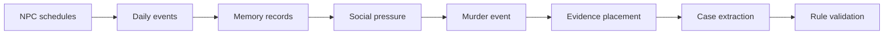

# World Model

Detective Town treats a mystery as data extracted from a simulated world, not as a free-form story.

## Core Records

- `WorldState`: seed, mode, clock, locations, NPCs, memories, simulation reports, and active case id.
- `NPCProfile`: role, schedule, relationships, secret, motive seed, skills, lie policy, and memory event ids.
- `WorldEvent`: event-sourced log item with actors, location, time, public summary, hidden summary, tags, and optional evidence id.
- `MemoryRecord`: NPC-scoped memory linked to one `WorldEvent`.
- `CaseFromLog`: extracted playable case with source map, testimonies, quality report, validation report, and `DeductionCase`.

## Pipeline

The important invariant is sourceability: decisive clues and timeline steps must trace back to `WorldEvent` records.
