# World Model

Detective Town treats a mystery as data extracted from a simulated world, not as a free-form story.

## Core Records

- `WorldState`: seed, mode, clock, locations, NPCs, memories, simulation reports, and active case id.
- `NPCProfile`: role, schedule, relationships, secret, motive seed, skills, lie policy, and memory event ids.
- `WorldEvent`: event-sourced log item with actors, location, time, public summary, hidden summary, tags, optional evidence id, and optional causal fields.
- `MemoryRecord`: NPC-scoped memory linked to one `WorldEvent`.
- `CaseFromLog`: extracted playable case with source map, testimonies, quality report, validation report, causal trace, and `DeductionCase`.
- `NpcGoal`: an NPC objective with priority, target location, and optional linked secret.
- `NpcIntent`: the local reason behind an action, such as hiding a secret, preparing a method, following a target, or staging a scene.
- `CausalEventLink`: source-to-target relationship explaining why one event caused or enabled another.
- `WorldCausalTrace`: ordered event chain showing how ordinary life, secret pressure, conflict, method access, murder, staging, and evidence placement connect.

## Pipeline

```mermaid
flowchart LR
  A["NPC schedules"] --> B["Daily events"]
  B --> C["NPC goals"]
  C --> D["NPC intents"]
  D --> E["Memory records"]
  E --> F["Social pressure"]
  F --> G["Causal trace"]
  G --> H["Murder event"]
  H --> I["Evidence placement"]
  I --> J["Case extraction"]
  J --> K["Rule validation"]
```



The important invariant is sourceability: decisive clues and timeline steps must trace back to `WorldEvent` records.

## Causal Trace Rules

The causal trace is explanatory, not authoritative. It never decides the culprit by itself. Local hard-case rules still validate motive, means, opportunity, exclusions, and evidence availability.

Current validation checks:

- The trace has ordered nodes covering daily setup, pressure, conflict, method access, murder, staging, and clue discovery.
- Decisive evidence events have either an intent or a cause link.
- The quality report exposes `emergenceScore`, `causalTraceComplete`, and `intentBackedEvents`.
- Before the player solves the case, the UI hides culprit-revealing causal nodes unless their evidence has been discovered.

## Emergence Proof Trace

`buildEmergenceProofTrace(world, events, caseFromLog, options)` turns the world model into a player-safe proof chain:

```text
NPC goals -> NPC intents -> WorldEvents -> MemoryRecords -> Evidence -> Case extraction -> Local validation
```

The proof trace is used by the UI and by the benchmark runner. Each node carries source ids for NPCs, events, memories, and evidence. Before the case is solved, hidden events and hidden memories are represented as locked nodes unless their evidence has already been discovered.

`evaluateWorldEmergence` produces the boolean proof checks used in the UI:

- generated case;
- unique culprit;
- world-backed evidence;
- memory-scoped testimony;
- non-culprit exclusions;
- timeline consistency;
- hard logic validity;
- causal trace completeness;
- reasoning trace completeness.
